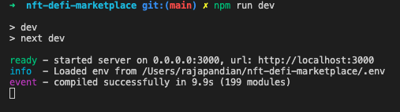

#  SIDE-PROJECT: NFT DEFI MARKETPLACE

# Motivation

- To build an NFT marketplace by understanding the ERC721 and ERC1155 standards
- Implement contracts using the EIP standard and also understand the usage of audited contracts from [OpenZeppelin](https://openzeppelin.com/contracts/)

# Objective

- Build an imaginary NFT Decentralized Finance marketplace where finance products can be minted and traded on the platform

# Technologies

- Smart Contract - Solidity
- Frontend - NextJS
- Integration - ethers
- Development Runtime - HardHat, IPFS

# Setup

1. Run `npm install` from the project's root directory, which will install all the dependencies
2. [IPFS CLI or Desktop](https://ipfs.io/#install) must be installed for the asset storage to work
3. Issue the following commands for the IPFS endpoints to bypass CORS errors
    - `./ipfs config --json API.HTTPHeaders.Access-Control-Allow-Origin '["*"]'`
    - `./ipfs config --json API.HTTPHeaders.Access-Control-Allow-Methods "[\"PUT\", \"POST\", \"GET\"]"`
    - `./ipfs config --json API.HTTPHeaders.Access-Control-Allow-Credentials '["true"]'`    
# Execution (Open multiple terminal/ console windows)

1. Start the local IPFS instance either from IPFS CLI or Desktop. IPFS CLI - `/ipfs daemon`
   
----------
2. Start the Hardhat ethereum instance by issuing the command `npx hardhat node --hostname 127.0.0.1`
   
----------
3. Deploy the smart contracts to the local ethereum EVM by issuing the command `npx hardhat run scripts/deploy.js --network localhost`
    
    
----------
4. Start the frontend by issuing the command `npm run dev`
   
   
----------
5. Configure Metamask for the local EVM instance and accounts
   1. Connecting to Local EVM Network
   
   1. Configuring accounts using private keys from Hardhat. Add 2 accounts to perform the role of admin and buyer
   
----------
6. Select the account as admin in Metamask and on the [Marketplace](http://localhost:3000), click the [Mint Product](http://localhost:3000/mint-item) link to mint a new NFT to the marketplace
   
----------
7. You will have to approve 2 transactions in Metamask, one to mint the NFT and the other is to list the NFT in the marketplace and approve grants to the marketplace to enable trade on behalf of the buyer
----------
8. Select the other account as buyer and visit the [Marketplace](http://localhost:3000/) and you'll find the minted NFT with the buy enabled. When you click on buy, Metamask will prompt for approval of trade. Once approved, the NFT will be transferred to the buyer. You can view the purchased NFTs from [My NFTs](http://localhost:3000/my-nfts)
   
   
----------
1. Switch to admin account and visit [Account Dashboard](http://localhost:3000/account-dashboard) to view all the NFTs minted
    

 ----------
  
  ## Queries/ Suggesstions?

  [Email](mailto:rajapandianc@outlook.in)
  ----------
  [Twitter](https://twitter.com/crpcodes)
  ----------
  [LinkedIn](https://www.linkedin.com/in/rajapandianc/)
  ----------

